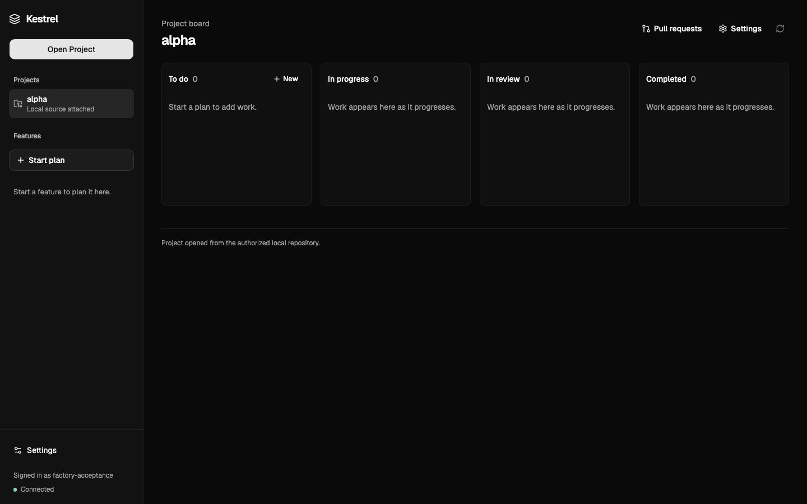
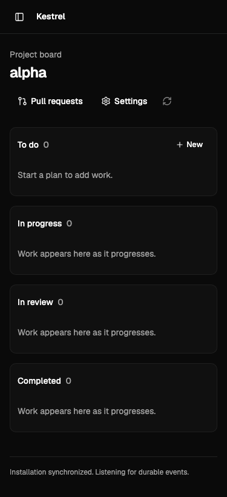

# Factory 0.1 acceptance

Acceptance target: [Factory 0.1-10](https://github.com/Ic3b3rg/kestrel/issues/219), exercised on
2026-09-20 against the integrated implementation.

## Supported operator path

1. Start the local Installation with `npm run dev`, sign in, and open an authorized Project.
2. Start a Feature from **+ New** on the Project board or **Start plan** in the sidebar. The first
   accepted prompt names the Feature and begins its durable chat.
3. Use Project Markdown and imported planning Skills to clarify the request. Generate, inspect, and
   approve one exact plan version.
4. Follow its dependency-ordered Work Items on the Kanban. Kestrel creates or links GitHub issues,
   executes ready work automatically, and pauses on a visible Human Gate when authority is missing.
5. Inspect cumulative verification and the one Feature pull request. Start an independent Conceptual
   Review and explore acceptance outcome → behavior → source/check evidence → problem.
6. Select bounded corrections when needed. Kestrel updates the same branch and PR, then requires a
   new review for the new exact head.
7. Explicitly approve merge for the reviewed head. Only a confirmed provider merge moves every Work
   Item to Completed and closes Kestrel-owned issue work.

The workstation must remain awake and the local Installation must remain running while background
work proceeds. Closing or reloading the browser does not cancel accepted work.

## Acceptance evidence

| Boundary                       | Exercised behavior                                                                                                                                                                         | Evidence                                                                                                                                                        |
| ------------------------------ | ------------------------------------------------------------------------------------------------------------------------------------------------------------------------------------------ | --------------------------------------------------------------------------------------------------------------------------------------------------------------- |
| Standard launcher              | Migrated PostgreSQL plus host web, worker, and PWA; first Operator sign-in; authorized repository discovery; stop and restart with retained Project state                                  | `npm run dev` with an isolated Compose project and state root, followed by a controlled restart                                                                 |
| Live Codex connection          | The installed, ChatGPT-authenticated Codex App Server starts and exposes its current catalog                                                                                               | `KESTREL_LIVE_CODEX=1 npx vitest run apps/web/src/codex-app-server.live.test.ts`                                                                                |
| Live planning                  | Real model turns, Skill-guided questioning, Unicode-safe chat, structured plan generation, approval, and durable recovery                                                                  | `KESTREL_LIVE_CODEX=1 npx vitest run apps/web/src/codex-planning-runtime.live.test.ts apps/web/src/factory-planning.live.test.ts`                               |
| Live implementation and review | Real Codex planning; two dependent Work Items in isolated, network-disabled containers; cumulative checks; exact-head PR publication; real independent Conceptual Review; restart recovery | `KESTREL_LIVE_FACTORY_EXECUTION=1 KESTREL_FACTORY_EXECUTION_IMAGE=<prepared-image-id> npm run test:black-box -- tests/black-box/factory-execution.live.test.ts` |
| GitHub writes                  | Issue, branch, PR, correction, merge, required-check, and issue-close behavior including uncertain responses and exact-head conflicts                                                      | Local bare Git remote plus bounded `gh` provider fixture; no real repository was mutated                                                                        |
| Browser workflow               | Project selection, persistent chat, plan approval, ordered board, Human Gate, PR, review graph, correction selection, and explicit merge                                                   | Playwright black-box suite against the production PWA/API boundary                                                                                              |
| Scheduling and recovery        | Two Projects progress independently; a gate reserves only its Project; reconnect and controlled process interruption recover durable work without duplicate writes                         | Factory scheduling, gate, publication, correction, merge, and live shutdown/recovery scenarios                                                                  |
| Accessibility and layout       | Keyboard navigation, accessible names, automated Axe checks, no page-wide overflow, and truthful loading/blocked/failed states                                                             | Desktop and 375 px browser runs; screenshots below                                                                                                              |

The destructive provider branches use controlled fixtures by design. Model planning, implementation,
repair, final verification, and Conceptual Review use the production Codex adapters. Container
execution uses the immutable image produced by `npm run factory:prepare`.

## Browser captures

Desktop Project board:

Narrow Project board:

## Pilot and material limits

The read-only [Veduta pilot profile](veduta-pilot.md) records its package manager, runtime, standard
check, separate browser suite, and the selected existing pilot issue. The issue was not claimed or
applied during acceptance.

Factory 0.1 runs on one Operator workstation. It supports two Projects concurrently and one active
Feature per Project. Work pauses when that workstation sleeps or the Installation stops. GitHub is
the only issue/PR provider, repository access comes from the host `git`/`gh` sessions, and execution
has no network access. Hosted execution, GitLab, team accounts, deployment, preview environments,
and automatic repair of published review findings remain outside 0.1.

Task-owned temporary repositories, execution containers, and test database services are removed at
the end of their scenarios. The launcher's named database volume and Operator state remain intact
unless the Operator explicitly requests a reset.
