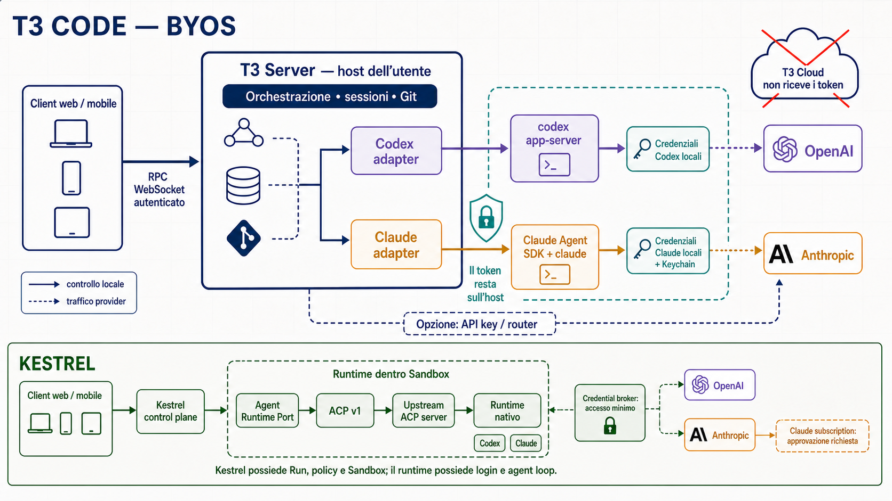

# T3 Code BYOS: architettura di autenticazione e confronto con Kestrel

**Stato:** valutazione riproducibile e source-pinned; non è un `Review Claim` Kestrel con `Claim Basis: Deterministic`

**Data di verifica:** 2026-08-17

**Snapshot T3 Code:** commit [`cd096b9ad5a4156ffeab85de617cbb219057007f`](https://github.com/pingdotgg/t3code/tree/cd096b9ad5a4156ffeab85de617cbb219057007f)

**Snapshot Codex:** commit [`21cfd369efca2df70c904c580b2e7e2e3eddb3c3`](https://github.com/openai/codex/tree/21cfd369efca2df70c904c580b2e7e2e3eddb3c3)

**Ambito:** login e uso di subscription Codex/Claude, posizione delle credenziali, boundary di esecuzione, differenze rispetto alla direzione già decisa per Kestrel.



## Risposta breve

Kestrel **può riutilizzare il principio tecnico di T3 Code**. In realtà, per Codex la direzione già registrata è sostanzialmente la stessa: Kestrel orchestra un runtime locale, mentre il runtime nativo possiede login, token refresh, agent loop e rapporto con il provider.

T3 Code non è un broker OAuth comune e non converte una subscription in una API key. Fa questo:

```text
client T3
  -> server T3 sull'host di esecuzione
      -> adapter specifico del provider
          -> processo/SDK nativo già autenticato su quell'host
              -> provider del modello
```

La subscription Claude non è stata esclusa da Kestrel perché il flusso sia tecnicamente impossibile. È stata esclusa come promessa di prodotto predefinita perché rimangono due problemi distinti:

1. la documentazione Anthropic attuale vieta ai third-party developer di offrire il login `claude.ai` o instradare credenziali Free/Pro/Max per conto degli utenti senza un'autorizzazione applicabile;
2. Kestrel richiede che il runtime viva dentro una Sandbox gestita da Kestrel, quindi non può limitarsi a riutilizzare silenziosamente il Keychain e l'intero profilo dell'host come fa un'app locale.

La conclusione corretta è quindi: **stesso pattern sì; stessa promessa commerciale per Claude no, finché autorizzazione e collocazione sicura delle credenziali non sono risolte**.

## Prima distinzione: “subscription” indica due cose diverse

T3 usa sia subscription commerciali sia stream sottoscritti, ma non sono la stessa architettura.

| Termine | Significato | Funzione |
| --- | --- | --- |
| Provider subscription | Piano ChatGPT, Claude, Cursor, ecc. dell'utente | Autorizza il runtime nativo a consumare il servizio del provider |
| RPC stream subscription | `subscribeThread`, `subscribeShell`, configurazione e terminale sul WebSocket T3 | Aggiorna i client web/mobile/desktop in tempo reale |
| Runtime event stream | Eventi normalizzati emessi da ogni adapter | Permette all'orchestratore T3 di osservare messaggi, tool, approvazioni e stato |

Il WebSocket autentica il client verso il server T3. **Non autentica T3 verso OpenAI o Anthropic.** Il codice descrive un solo WebSocket RPC autenticato e stream server-side selettivi; i processi dei provider vivono oltre un secondo boundary, con trasporto specifico per driver. ([architettura T3, righe 5-44](https://github.com/pingdotgg/t3code/blob/cd096b9ad5a4156ffeab85de617cbb219057007f/docs/internals/overview.md#L5-L44))

## Dove gira T3 e dove avviene il login

### 1. Il server T3 è l'execution boundary

**Fatto da sorgente.** Il server T3 possiede sessioni, workspace, Git, terminali e filesystem; client web, desktop e mobile si collegano via RPC WebSocket autenticato. Tutti i processi provider vengono eseguiti sul server, non nel client. ([overview, righe 5-28](https://github.com/pingdotgg/t3code/blob/cd096b9ad5a4156ffeab85de617cbb219057007f/docs/internals/overview.md#L5-L28))

**Fatto da sorgente.** In uno scenario remoto, una singola istanza T3 continua a possedere provider availability e autenticazione. L'app hosted memorizza localmente il riferimento all'environment e si collega direttamente al backend; non mantiene una copia server-side dello stato e non fa da proxy al traffico HTTP/WebSocket. ([remote architecture, righe 10-49](https://github.com/pingdotgg/t3code/blob/cd096b9ad5a4156ffeab85de617cbb219057007f/docs/internals/remote.md#L10-L49), [righe 104-123](https://github.com/pingdotgg/t3code/blob/cd096b9ad5a4156ffeab85de617cbb219057007f/docs/internals/remote.md#L104-L123))

### 2. Il login si esegue sull'host del server

**Fatto da sorgente.** T3 richiede che la CLI del provider sia installata e già autenticata. La sua guida dice esplicitamente di eseguire `codex login` o `claude auth login` sulla macchina che esegue il server T3, non sul telefono o browser usato come client. ([installazione, righe 52-83](https://github.com/pingdotgg/t3code/blob/cd096b9ad5a4156ffeab85de617cbb219057007f/docs/user/install.md#L52-L83))

**Fatto da sorgente.** Nel commit analizzato non esiste una chiamata applicativa T3 a `account/login/start`; quel nome compare soltanto nello schema Codex generato. Il probe T3 usa `account/read` e, se l'account manca, mostra l'istruzione `codex login`. ([Codex provider, righe 322-405](https://github.com/pingdotgg/t3code/blob/cd096b9ad5a4156ffeab85de617cbb219057007f/apps/server/src/provider/Layers/CodexProvider.ts#L322-L405), [righe 474-500](https://github.com/pingdotgg/t3code/blob/cd096b9ad5a4156ffeab85de617cbb219057007f/apps/server/src/provider/Layers/CodexProvider.ts#L474-L500))

**Inferenza supportata.** Il prodotto T3 non implementa quindi un login universale: scopre e controlla runtime che hanno già il proprio stato di autenticazione. Questo è il significato tecnico di “bring your own subscription”.

## Flusso Codex

```text
Operatore, sull'host T3
  -> codex login
      -> Codex gestisce OAuth ChatGPT e persistenza credenziali

Client T3
  -> RPC WebSocket T3
      -> Codex adapter
          -> spawn: codex app-server
              -> CODEX_HOME / auth Codex
                  -> OpenAI
```

1. **Fatto da sorgente.** T3 avvia `codex app-server` come processo figlio, eredita l'environment e imposta opzionalmente `CODEX_HOME`. Poi esegue `initialize`, `account/read`, `skills/list` e `model/list`. ([Codex provider, righe 322-405](https://github.com/pingdotgg/t3code/blob/cd096b9ad5a4156ffeab85de617cbb219057007f/apps/server/src/provider/Layers/CodexProvider.ts#L322-L405))
2. **Fatto da sorgente upstream.** Codex App Server supporta autenticazione API key, ChatGPT-managed OAuth, device code e altre modalità. In modalità ChatGPT, Codex possiede il flusso, persiste i token e li aggiorna. ([Codex App Server, auth endpoints](https://github.com/openai/codex/blob/21cfd369efca2df70c904c580b2e7e2e3eddb3c3/codex-rs/app-server/README.md#auth-endpoints))
3. **Fatto da sorgente.** Per account multipli, T3 usa un `CODEX_HOME` condiviso per lo stato continuabile e shadow home distinti; `auth.json` resta privato per account. ([provider Codex, righe 31-118](https://github.com/pingdotgg/t3code/blob/cd096b9ad5a4156ffeab85de617cbb219057007f/docs/user/providers-codex.md#L31-L118), [righe 120-141](https://github.com/pingdotgg/t3code/blob/cd096b9ad5a4156ffeab85de617cbb219057007f/docs/user/providers-codex.md#L120-L141))
4. **Inferenza supportata.** T3 non deve conoscere né rivendere il refresh token: deve mantenere vivo il processo, inviargli comandi e tradurre i suoi eventi.

## Flusso Claude

```text
Operatore, sull'host T3
  -> claude auth login
      -> Claude Code salva lo stato nel profilo/Keychain

Client T3
  -> RPC WebSocket T3
      -> Claude adapter
          -> Claude Agent SDK query(...)
              -> processo claude
                  -> CLAUDE_CONFIG_DIR + credenziali OS
                      -> Anthropic
```

1. **Fatto da sorgente.** T3 dichiara una dipendenza dal Claude Agent SDK e il suo adapter invoca `query()`, indicando l'eseguibile Claude, il modello, il permission mode, `canUseTool`, l'environment, le directory accessibili e l'eventuale sessione da riprendere. ([dipendenza SDK](https://github.com/pingdotgg/t3code/blob/cd096b9ad5a4156ffeab85de617cbb219057007f/apps/server/package.json#L24-L48), [creazione query](https://github.com/pingdotgg/t3code/blob/cd096b9ad5a4156ffeab85de617cbb219057007f/apps/server/src/provider/Layers/ClaudeAdapter.ts#L1660-L1689), [opzioni runtime](https://github.com/pingdotgg/t3code/blob/cd096b9ad5a4156ffeab85de617cbb219057007f/apps/server/src/provider/Layers/ClaudeAdapter.ts#L4140-L4232))
2. **Fatto da sorgente.** Quando è configurata una home Claude separata, T3 imposta `CLAUDE_CONFIG_DIR` ma non cambia `HOME`, proprio per non perdere l'accesso alle credenziali OAuth nel Keychain macOS. ([Claude home, righe 17-40](https://github.com/pingdotgg/t3code/blob/cd096b9ad5a4156ffeab85de617cbb219057007f/apps/server/src/provider/Drivers/ClaudeHome.ts#L17-L40))
3. **Fatto da sorgente upstream.** Claude Code conserva le credenziali nel Keychain su macOS e in `.credentials.json` su Linux/Windows; supporta anche API key, cloud provider e token OAuth configurati. ([autenticazione Claude Code](https://code.claude.com/docs/en/team))
4. **Fatto da sorgente.** T3 supporta anche configurazioni Claude con API key, OpenRouter o router locale tramite environment separati. La subscription non è quindi obbligatoria in ogni provider instance. ([provider Claude, righe 105-215](https://github.com/pingdotgg/t3code/blob/cd096b9ad5a4156ffeab85de617cbb219057007f/docs/user/providers-claude.md#L105-L215))
5. **Inferenza supportata.** Come per Codex, l'agent loop e il protocollo di autenticazione restano responsabilità del runtime upstream; T3 controlla il runtime ma non rende le credenziali portabili fra provider.

## Cosa significano davvero le promesse di marketing

| Promessa | Lettura supportata dal codice | Limite reale |
| --- | --- | --- |
| “No keys resold” | T3 usa l'identità già posseduta dalla CLI locale; non vende token propri | Il processo T3/runtime opera comunque nello stesso ambiente delle credenziali locali o di secret configurati |
| “No quota caps” | T3 non aggiunge un proprio contatore di token al piano del provider | Restano rate limit, fair-use, crediti e limiti del provider; T3 mostra anche costi API-equivalent separati dalla fatturazione subscription ([usage](https://github.com/pingdotgg/t3code/blob/cd096b9ad5a4156ffeab85de617cbb219057007f/docs/user/usage.md#L1-L10)) |
| “Switch models mid-thread” | Il model switch è una capability dichiarata per adapter e può funzionare in una sessione compatibile | Il codice rifiuta il passaggio a un driver diverso e rifiuta resume state incompatibili; non significa passare liberamente da Claude a Codex nello stesso thread ([reactor, righe 579-600](https://github.com/pingdotgg/t3code/blob/cd096b9ad5a4156ffeab85de617cbb219057007f/apps/server/src/orchestration/Layers/ProviderCommandReactor.ts#L579-L600)) |

## Perché il pattern non si trasferisce identico a Kestrel

### Differenza 1: host dell'utente contro Sandbox Kestrel

T3 assume come execution boundary la macchina su cui gira il suo server. Il runtime può quindi vedere il normale profilo utente, il Keychain, `CODEX_HOME`, `CLAUDE_CONFIG_DIR`, repository, terminale e Git. T3 stesso raccomanda il full access soltanto in un worktree o sandbox sacrificabile; non dichiara che ogni sessione sia già dentro una Sandbox di sistema. ([permission modes, righe 3-45](https://github.com/pingdotgg/t3code/blob/cd096b9ad5a4156ffeab85de617cbb219057007f/docs/user/permission-modes.md#L3-L45))

Kestrel ha invece già definito un `Agent Run` come esecuzione persistente dentro una **Sandbox gestita da Kestrel**, non sul workstation dell'Operator. Copiare automaticamente l'intera home o montare il Keychain nella Sandbox allargherebbe l'autorità del workload e contraddirebbe il principio già documentato di “authority below the runtime, observability through the runtime”. Vedi [`CONTEXT.md`](../../CONTEXT.md) e [`review-first-runtime-tool-containment.md`](./review-first-runtime-tool-containment.md).

### Differenza 2: adapter nativi contro un unico boundary ACP

T3 investe in adapter nativi per provider dietro un'interfaccia comune che include session start, turn, interrupt, approval, input, rollback e stream di eventi. ([ProviderAdapter](https://github.com/pingdotgg/t3code/blob/cd096b9ad5a4156ffeab85de617cbb219057007f/apps/server/src/provider/Services/ProviderAdapter.ts#L45-L125))

Kestrel ha già deciso un solo adapter iniziale:

```text
Kestrel Agent Runtime Port
  -> ACP v1
      -> upstream ACP server
          -> runtime nativo
```

Questa scelta non impedisce BYOS: sposta semplicemente la responsabilità del login ancora più chiaramente nell'upstream runtime. La decisione è registrata in [issue #25](https://github.com/Ic3b3rg/kestrel/issues/25#issuecomment-5307919342).

### Differenza 3: Codex e Claude non hanno la stessa autorizzazione di prodotto

**Fatto da sorgente OpenAI.** Codex App Server documenta esplicitamente il login ChatGPT gestito e il relativo piano; Codex CLI raccomanda il login ChatGPT per usare i piani supportati. Questo rende Codex il percorso subscription-first già scelto da Kestrel. ([Codex App Server](https://github.com/openai/codex/blob/21cfd369efca2df70c904c580b2e7e2e3eddb3c3/codex-rs/app-server/README.md#authentication-modes), [Kestrel issue #26](https://github.com/Ic3b3rg/kestrel/issues/26#issuecomment-5315994828))

**Fatto da sorgente Anthropic, verificato il 2026-08-17.** La pagina legal/compliance dice che i developer di prodotti o servizi, incluso l'uso dell'Agent SDK, dovrebbero usare API key o cloud provider e che Anthropic non consente ai third-party developer di offrire login `claude.ai` o instradare credenziali Free/Pro/Max per conto degli utenti. Invita a contattare sales per il caso d'uso. ([Anthropic legal and compliance](https://code.claude.com/docs/en/legal-and-compliance))

**Fatto da sorgente Anthropic, ma non equivalente a un'autorizzazione.** Un articolo di supporto aggiornato il 2026-06-16 dice che, per ora, Agent SDK, `claude -p` e third-party app usage continuano tecnicamente ad attingere ai limiti della subscription. Questa descrizione di funzionamento non annulla da sola la restrizione della pagina legal/compliance. ([Claude Help Center](https://support.claude.com/en/articles/15036540-use-the-claude-agent-sdk-with-your-claude-plan))

**Non dimostrato.** Il repository pubblico T3 analizzato non documenta se T3 abbia un'approvazione Anthropic, un accordo distinto o una diversa interpretazione applicabile al proprio prodotto locale. L'assenza di tale documento pubblico non dimostra né autorizzazione né violazione.

**Conclusione di prodotto, non parere legale.** Kestrel non dovrebbe promettere Claude subscription finché Anthropic non conferma per iscritto che il preciso deployment e flusso Kestrel sono consentiti. Tecnicamente il runtime può funzionare; commercialmente e contrattualmente il supporto non è ancora attestato.

## Architettura Kestrel compatibile con BYOS

Il pattern compatibile non richiede di copiare T3 né di aggiungere subito due adapter nativi:

```text
Operator
  -> seleziona Runtime Profile e access path esplicito

Kestrel control plane
  -> crea Agent Run e Sandbox
  -> conserva stato durevole, policy, gate, audit e artefatti
  -> parla con Agent Runtime Port

Agent Runtime Port
  -> ACP v1
      -> upstream ACP server dentro la Sandbox
          -> runtime nativo
              -> usa un profilo di autenticazione esplicito e isolato
                  -> provider
```

Requisiti minimi:

- nessun fallback silenzioso da subscription ad API key;
- una credenziale/runtime profile isolata per Operator e Project, non l'intera home dell'host;
- il runtime possiede token format, refresh e login UX;
- Kestrel possiede Sandbox, egress, lifecycle, cancellation escalation e audit;
- Codex subscription è supportabile tramite il runtime ufficiale;
- Claude subscription resta `unsupported-pending-vendor-approval`; Claude API key/cloud può essere un percorso separato;
- l'assenza o scadenza dell'autenticazione produce uno stato esplicito, non una degradazione automatica.

Questo completa, senza sostituirle, le decisioni di [issue #25](https://github.com/Ic3b3rg/kestrel/issues/25), [issue #26](https://github.com/Ic3b3rg/kestrel/issues/26) e la domanda ancora aperta sulla containment in [issue #27](https://github.com/Ic3b3rg/kestrel/issues/27).

## Ledger delle conclusioni

| ID | Conclusione | Classificazione |
| --- | --- | --- |
| T3-01 | T3 esegue i provider sul server/environment dell'utente e li controlla da client remoti | Fatto da sorgente |
| T3-02 | Il login provider avviene sull'host del server tramite la CLI upstream | Fatto da sorgente |
| T3-03 | T3 non implementa un OAuth broker universale | Inferenza riproducibile da docs, chiamate e ricerca del commit |
| T3-04 | Codex viene controllato tramite `codex app-server` e `CODEX_HOME` | Fatto da sorgente |
| T3-05 | Claude viene controllato tramite Agent SDK/CLI e profilo/Keychain dell'host | Fatto da sorgente |
| T3-06 | T3 supporta anche API key/router; non usa sempre una subscription | Fatto da sorgente |
| T3-07 | Il hosted client T3 non è il proxy del traffico verso il backend T3 | Fatto da sorgente |
| T3-08 | “Switch models mid-thread” non permette il cambio di driver in una sessione già avviata | Fatto da sorgente |
| K-01 | Kestrel può adottare il medesimo ownership split attraverso ACP | Conclusione architetturale supportata dalle decisioni Kestrel |
| K-02 | Codex subscription-first è coerente con le superfici ufficiali e con la decisione Kestrel | Fatto da sorgente + decisione Kestrel |
| K-03 | Claude subscription è tecnicamente possibile ma non autorizzabile come promessa Kestrel senza conferma applicabile | Fatto da sorgente + conclusione prudenziale |
| U-01 | T3 possiede un'approvazione Anthropic specifica | Non dimostrato |

## Limiti e criterio di falsificazione

- Il codice T3 è fissato al commit indicato; una versione successiva può introdurre un login broker o cambiare adapter.
- Le pagine Anthropic non sono versionate nel repository T3 e devono essere riattestate prima dell'implementazione o del lancio.
- Questa analisi non prova cosa faccia un binario T3 distribuito se non corrisponde al commit ispezionato.
- La conclusione Claude cambia se Anthropic fornisce a Kestrel un'approvazione scritta per il flusso preciso o pubblica termini che lo consentono chiaramente.
- La conclusione sulla sicurezza cambia soltanto dopo un probe che dimostri isolamento delle credenziali, egress fail-closed e containment dei discendenti del runtime dentro la Sandbox.

## Riproduzione essenziale

```bash
git clone https://github.com/pingdotgg/t3code.git
git -C t3code checkout cd096b9ad5a4156ffeab85de617cbb219057007f

rg -n "codex login|claude auth login" t3code/README.md t3code/docs/user
rg -n "account/login/start|account/read" t3code/apps t3code/packages
rg -n "CODEX_HOME|CLAUDE_CONFIG_DIR|keychain" t3code/apps/server/src/provider t3code/docs/user
rg -n "query\(|app-server" t3code/apps/server/src/provider
rg -n "cannot switch|continuationKey" t3code/apps/server/src/orchestration
```
